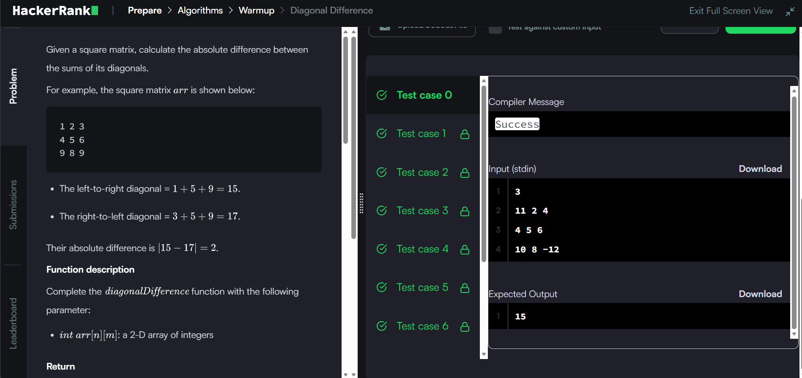
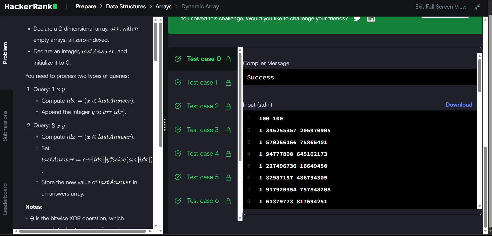
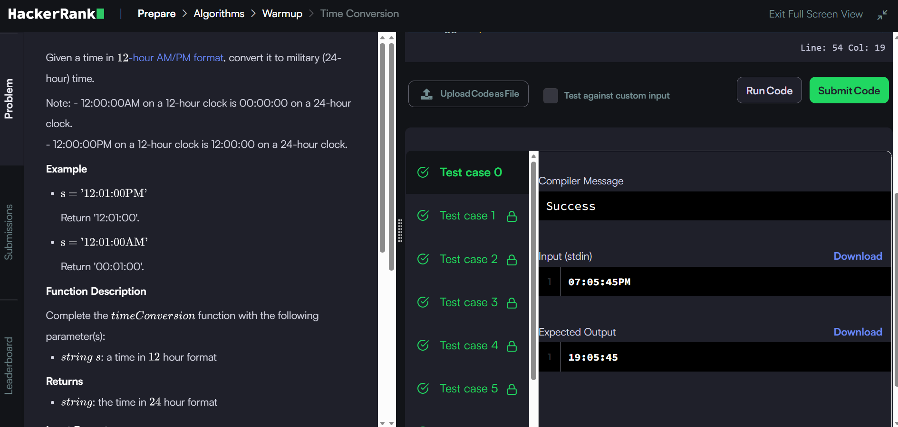
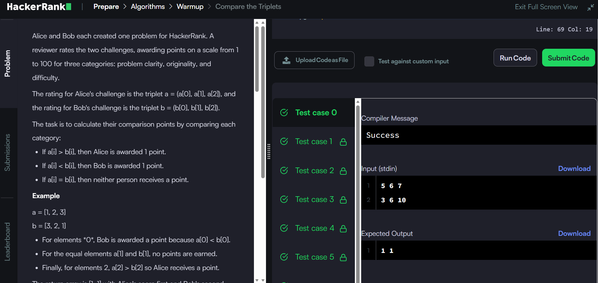
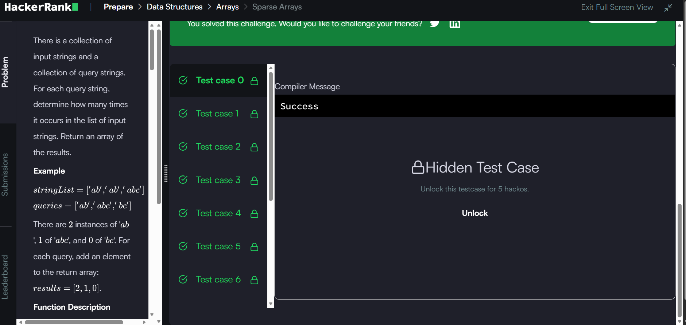

# HackerRank 3rd Sem Portfolio - Algorithmic Problem Solving

**Student Name:** Anjan Kumar B H  
**USN / ID:** B25CS0311  
**HackerRank Profile:** [https://www.hackerrank.com/profile/anjankumar0937]

---

## 📊 Complexity Analysis Summary

| # | Problem Name | Time Complexity | Space Complexity | Key Concept |
|---|---|---|---|---|
| 1 | Diagonal Difference | $O(N)$ | $O(1)$ | 2D Matrix primary & secondary diagonal traversal |
| 2 | Dynamic Array | $O(N + Q)$ | $O(N)$ | 2D dynamic sequence indexing via Bitwise XOR |
| 3 | Time Conversion | $O(1)$ | $O(1)$ | 12-hour AM/PM string parsing using `sscanf`/`sprintf` |
| 4 | Compare the Triplets | $O(1)$ | $O(1)$ | Array element comparison and score tracking |
| 5 | Sparse Arrays | $O(N \times Q)$ | $O(Q)$ | String matching frequency using `strcmp` |

---

## 🏆 HackerRank Badges & Proofs

### Verified HackerRank Badge

### Accepted Submissions
- **Diagonal Difference:**
  
- **Dynamic Array:**
  
- **Time Conversion:**
  
- **Compare the Triplets:**
  
- **Sparse Arrays:**
  